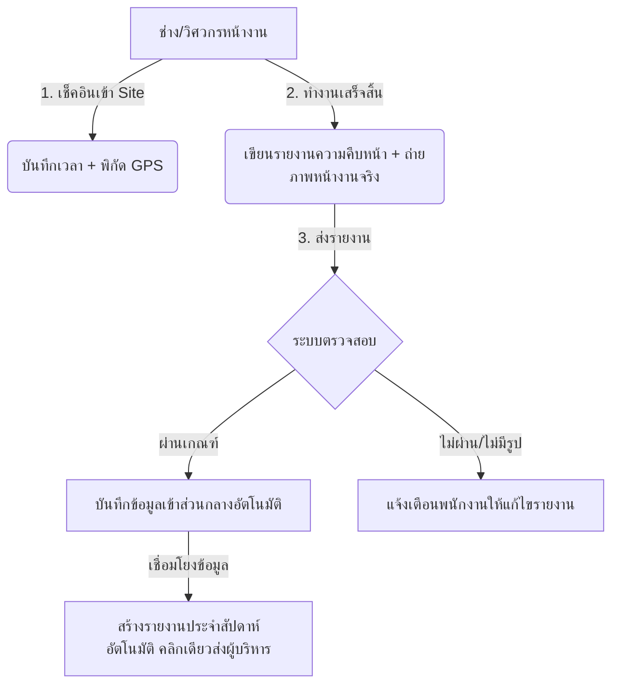

# ข้อเสนอโครงการระบบบริหารจัดการภายในสำหรับธุรกิจรับเหมาก่อสร้าง
## (WSA Backoffice for Construction Contractors)

---

### บทสรุปผู้บริหาร (Executive Summary)

ในธุรกิจรับเหมาก่อสร้าง การบริหารจัดการพนักงานที่ต้องออกไปปฏิบัติงานในหน่วยงานก่อสร้างต่าง ๆ (Site งาน) การจัดซื้อวัสดุก่อสร้าง และการเบิกจ่ายค่าใช้จ่ายหน้างาน เป็นกระบวนการที่มีความท้าทายสูงและมักเกิดปัญหาความไม่โปร่งใส ข้อมูลตกหล่น หรือความล่าช้าในการสื่อสารระหว่างหน้างานกับสำนักงานส่วนกลาง

ระบบ **WSA Backoffice** เป็นระบบบริหารจัดการภายในรูปแบบดิจิทัลแบบครบวงจร (SME Backoffice) ที่ได้รับการพัฒนาขึ้นด้วยเทคโนโลยี Next.js และ Supabase เพื่อแก้ไขปัญหาเหล่านี้โดยเฉพาะ ช่วยเปลี่ยนผ่านกระบวนการทำงานที่เป็นกระดาษไปสู่ระบบคลาวด์ที่รวดเร็ว ปลอดภัย และสามารถเข้าถึงได้ผ่านสมาร์ทโฟนของพนักงานทุกคน ซึ่งช่วยเพิ่มความโปร่งใสและสร้างประสิทธิภาพสูงสุดให้กับธุรกิจรับเหมาก่อสร้าง

---

### ปัญหาสำคัญของธุรกิจก่อสร้าง (Key Pain Points) และโซลูชันจาก WSA Backoffice

| ปัญหาหน้างาน (Pain Points) | แนวทางแก้ไขของ WSA Backoffice |
| :--- | :--- |
| **1. ไม่สามารถตรวจสอบได้ว่าพนักงานเข้างานจริงหรือไม่** | **ระบบ Check-in ด้วย GPS และการยืนยันตัวตนด้วยรูปภาพ** บังคับให้พนักงานลงเวลาเข้างานผ่านโทรศัพท์มือถือ โดยระบบจะบันทึกพิกัด GPS จริง พร้อมบังคับถ่ายรูปสภาพการทำงานส่งกลับมายังส่วนกลางทันที |
| **2. ขั้นตอนการขออนุมัติซื้อวัสดุหน้างานล่าช้า** | **ระบบคำร้องขอจัดซื้อวัสดุ (Purchase Request)** พนักงานสามารถส่งคำขอซื้อปูน, เหล็ก หรือวัสดุเร่งด่วนผ่านระบบได้ทันที ระบบจะวิ่งตามสายอนุมัติไปหาหัวหน้าโครงการหรือ CEO ตามวงเงินที่ตั้งไว้ พร้อมแจ้งเตือนแบบ Real-time |
| **3. พนักงานเบิกเงินสดย่อยหน้างานยากและตรวจสอบยาก** | **ระบบเบิกจ่ายเงินสดย่อย (Reimbursements / Petty Cash)** ให้พนักงานส่งรูปใบเสร็จค่าของ, ค่าน้ำมัน, หรือค่าแรงงานรายวัน เพื่อขอเบิกจ่ายออนไลน์ ช่วยให้ฝ่ายบัญชีตรวจสอบและอนุมัติได้อย่างรวดเร็ว |
| **4. การจัดสรรและควบคุมยานพาหนะของบริษัทติดขัด** | **ระบบจองรถและบันทึกเลขไมล์ (Car Booking)** สำหรับรถกระบะหรือรถขนส่งวัสดุ สามารถตรวจสอบตารางความว่างและจองใช้งานล่วงหน้า พร้อมระบบบันทึกเลขไมล์ตอนไปและกลับเพื่อป้องกันการนำรถไปใช้ส่วนตัว |
| **5. การรายงานผลการทำงานประจำวัน/สัปดาห์ล่าช้า** | **ระบบเชื่อมโยงรายงานผลงานอัตโนมัติ (Daily Log to Weekly Report)** พนักงานเพียงบันทึกเนื้องานสั้น ๆ ทุกวัน ระบบจะดึงข้อมูลมารวมเป็นรายงานประจำสัปดาห์ให้อัตโนมัติ ช่วยลดเวลาการทำงานเอกสารของช่างและวิศวกรหน้างาน |

---

### ฟังก์ชันและโมดูลการทำงานหลัก (Core System Modules)

#### 1. ระบบเช็คอินและรายงานผลงานหน้างานอัจฉริยะ (Onsite Smart Check-in & Photo Reporting) 🌟 *ฟีเจอร์เด่น*
* **การลงเวลาเข้างาน (Check-in):** พนักงานหน้างานลงเวลางานโดยเลือกสถานะ **"Onsite"** ระบบจะบันทึกพิกัด GPS ปัจจุบันเพื่อยืนยันว่าอยู่ที่ Site งานจริง
* **ระบบรายงานเนื้องานพร้อมรูปถ่าย (Photo Work Report):** เมื่อเสร็จสิ้นภารกิจประจำวัน พนักงานจะต้องกรอกเนื้องานที่ทำสำเร็จ (Work Done) **ร่วมกับการถ่ายรูปถ่ายหน้างานจริง** (เช่น ภาพความคืบหน้าของโครงสร้างปูน, การติดตั้งระบบไฟ, หรืออุปสรรคหน้างาน) ส่งกลับมาที่ระบบส่วนกลาง
* **ระบบคัดกรองส่วนกลาง (Central Verification):** ฝ่ายบริหาร หัวหน้าโครงการ หรือส่วนกลางสามารถเปิดดูแดชบอร์ดเพื่อตรวจสอบภาพถ่ายความคืบหน้าหน้างาน พิกัดแผนที่ และเวลาทำงานของพนักงานทุกคนได้ทันทีแบบ Real-time

#### 2. ระบบบริหารจัดการงานภายในสำนักงานและงานบุคคล (Office & HR Operations Management) 🏢
เพื่อรองรับการดำเนินงานในสำนักงานใหญ่ควบคู่ไปกับหน้างาน ระบบมีโมดูลหลักสำหรับจัดการบุคลากรและงานธุรการดังนี้:
* **ระบบลงเวลาทำงานและบันทึกเนื้องานรายวัน (Time Attendance & Daily Work Logs):** 
  - ลงเวลาทำงานจากทุกช่องทาง (Office, WFH, Onsite) พร้อมเก็บพิกัด GPS
  - บันทึกเนื้องานรายวัน (Daily Work Log): ช่วยติดตามประสิทธิภาพการทำงานของพนักงานรายวัน โดยมีระบบตั้งเวลา (Cron Job) ส่งอีเมลแจ้งเตือนให้พนักงานกรอกเนื้องานหลังเลิกงานเวลา 17.30 น.
* **ระบบจัดการการลาอิเล็กทรอนิกส์ (E-Leave Management):**
  - พนักงานยื่นคำขอลาพักร้อน ลากิจ หรือลาป่วยผ่านระบบ พร้อมระบุเหตุผลและแนบหลักฐาน (เช่น ใบรับรองแพทย์)
  - ระบบคำนวณโควตาวันลาคงเหลือแบบ Real-time ป้องกันการยื่นใบลาเกินสิทธิ์โดยอัตโนมัติ
  - วิ่งตามสายอนุมัติส่งต่อไปยังหัวหน้าแผนก และจบขั้นสุดท้ายที่ CEO เพื่อความรวดเร็วและถูกต้อง
* **ระบบข้อมูลสุขภาพพนักงานและการนัดหมายแพทย์ (Employee Health Profile & Doctor Appointments):**
  - เก็บบันทึกข้อมูลสุขภาพพื้นฐานที่จำเป็นต่อความปลอดภัย (หมู่เลือด, โรคประจำตัว, ประวัติการแพ้ยา, โรงพยาบาลประกันสังคม/รพ.ฉุกเฉิน) ช่วยให้สามารถปฐมพยาบาลพนักงานได้อย่างถูกต้องเมื่อเกิดอุบัติเหตุใน Site งาน
  - บันทึกและจัดการนัดหมายพบแพทย์ พร้อมระบบ Cron Job ส่งอีเมลเตือนพนักงานล่วงหน้า 7 วัน และ 1 วัน ป้องกันพนักงานลืมคิวนัดตรวจสุขภาพจนส่งผลกระทบต่อแผนงานก่อสร้าง
* **ระบบกระดานข่าวสารและปฏิทินวันหยุดบริษัท (Noticeboard & Bank Holiday Calendar):**
  - กระดานประชาสัมพันธ์ประกาศนโยบายความปลอดภัย ข่าวสารโครงการ หรือข้อกำหนดเร่งด่วน โดยแบ่งประเภทเป็น ประกาศทั่วไป นโยบาย หรือวันหยุด
  - ปฏิทินวันหยุดประจำปี 2569: รวบรวมวันหยุดตามประเพณีของสถาบันการเงินอ้างอิงจาก ธปท. จำนวน 20 วัน แสดงผลในรูปแบบเดือนที่ขยาย/ย่อข้อมูลได้ ช่วยให้ฝ่ายบุคคลและพนักงานเห็นตารางวันหยุดที่ตรงกัน

#### 3. ระบบขอจัดซื้อวัสดุและอุปกรณ์ก่อสร้าง (Construction Procurement Management)
* **สร้างคำขอรวดเร็ว:** วิศวกรหน้างานสามารถสร้างคำร้องขอซื้อวัสดุ (เช่น ปูน 50 ถุง, น็อต, เครื่องมือช่าง) ผ่านมือถือ โดยระบุรายละเอียดและแนบใบเสนอราคา
* **สายอนุมัติตามวงเงิน (Approval Hierarchy):** ระบบจะคำนวณวงเงินโดยอัตโนมัติ หากเป็นยอดเล็กน้อย หัวหน้างาน (Supervisor) สามารถอนุมัติได้ทันที แต่หากเป็นยอดใหญ่ (เช่น การสั่งซื้อเหล็กเส้นมูลค่าสูง) ระบบจะส่งต่อให้ CEO อนุมัติโดยอัตโนมัติ
* **ตรวจสอบสถานะได้ตลอดเวลา:** พนักงานหน้างานสามารถดูได้ว่าใบสั่งซื้อของตนเองได้รับการอนุมัติแล้วหรือยัง หรืออยู่ในขั้นตอนจ่ายเงิน (Paid) ของฝ่ายบัญชี

#### 4. ระบบเบิกเงินสดย่อยหน้างาน (Onsite Petty Cash & Reimbursements)
* **เบิกเงินผ่านมือถือ:** สำหรับค่าใช้จ่ายด่วนหน้างาน เช่น ค่าจ้างช่างรายวันภายนอก, ค่าจอดรถขนส่ง หรือค่าของเร่งด่วน พนักงานสามารถกรอกยอดเงินและถ่ายรูปใบเสร็จหรือหลักฐานการจ่ายเงินส่งเข้าระบบทันที
* **การเชื่อมโยงบัญชี:** บันทึกข้อมูลวัน เวลา และร้านค้าเพื่อเตรียมส่งออกให้ฝ่ายบัญชีทำเรื่องจ่ายคืนพนักงานอย่างถูกต้อง

#### 5. ระบบจองรถขนส่งและยานพาหนะส่วนกลาง (Logistics & Fleet Booking)
* **จองคิวรถยนต์:** ป้องกันปัญหารถขนส่งชนกัน พนักงานสามารถเข้ามาเช็คตารางและจองรถยนต์ของบริษัท (เช่น รถกระบะ รถบรรทุก) ล่วงหน้า
* **ควบคุมค่าใช้จ่ายน้ำมัน:** บังคับกรอกเลขไมล์ต้นทาง-ปลายทาง (Odometer Start/End) ช่วยให้ส่วนกลางตรวจสอบการใช้น้ำมันและประเมินรอบการบำรุงรักษารถได้แม่นยำ

---

### 📊 ฟีเจอร์สำคัญที่ CEO และผู้บริหารระดับสูงต้องการเห็น (CEO & Executive Key Insights)

ระบบได้รับการออกแบบโดยเน้นให้ผู้บริหารระดับสูงมีข้อมูล (Data-driven Insights) ในการตัดสินใจ และควบคุมต้นทุนได้อย่างรวดเร็ว:

1. **แดชบอร์ดเฉพาะสำหรับผู้บริหาร (CEO Dashboard - `/ceo`):**
   - **Financial Overview:** แสดงค่าใช้จ่ายสะสมจากการจัดซื้อและงบเบิกจ่ายเงินสดย่อยหน้างาน แบบแยกตามโครงการหรือแผนก ช่วยควบคุมไม่ให้งบบานปลาย
   - **Workforce Attendance & Leaves:** สรุปภาพรวมจำนวนพนักงานที่กำลังปฏิบัติงานหน้างาน (On-site), ทำงานที่ออฟฟิศ (Office), หรือปฏิบัติงานนอกสถานที่ พร้อมกราฟสรุปสถิติอัตราการลางานของพนักงานเพื่อประเมินความหนาแน่นของแรงงาน
2. **ศูนย์รวมการอนุมัติแบบจุดเดียว (One-Stop Approval Center):**
   - CEO สามารถเข้ามาอนุมัติทุกคำขอ (จัดซื้อวัสดุ, ใบลาพักร้อน, คำขอเบิกเงินสดย่อย, การจองใช้งานรถขนส่ง) ได้ในหน้ารวมที่เดียว โดยไม่ต้องสลับหน้าจอไปมา ช่วยประหยัดเวลาอย่างมาก
3. **การรายงานประจำสัปดาห์อัจฉริยะ (Smart Weekly Report & Import Daily Logs):**
   - ตรวจสอบรายงานประจำสัปดาห์ (Weekly Report) ของพนักงานแต่ละคนซึ่งเชื่อมโยงเนื้องานรายวัน (Daily Logs) เข้ามาอัตโนมัติ ทำให้ CEO เห็นความคืบหน้าและประเด็นปัญหาของทุกไซต์งานได้ภายในเวลาไม่กี่นาที
4. **ความปลอดภัยของข้อมูล (Row Level Security - RLS):**
   - รับประกันความปลอดภัยด้านข้อมูลการเงินและข้อมูลส่วนตัวพนักงานด้วยระบบ RLS ของ Supabase พนักงานทั่วไปจะเห็นเฉพาะข้อมูลของตนเอง ส่วนหัวหน้าแผนกและ CEO เท่านั้นที่มีสิทธิ์เข้าถึงรายงานสรุปทั้งหมด

---

### ประโยชน์ที่บริษัทรับเหมาก่อสร้างจะได้รับ (Business Benefits)

1. **ลดการทุจริตและการลงเวลาเท็จ (100% Transparency):** ด้วยระบบพิกัด GPS ควบคู่กับภาพถ่ายรายงานความคืบหน้างานจริง ทำให้ส่วนกลางมั่นใจได้ว่าพนักงานลงปฏิบัติงานที่หน้างานจริงตามเวลาที่ระบุ
2. **ควบคุมงบประมาณก่อสร้างได้แม่นยำ (Real-time Budget Control):** ฝ่ายบริหารเห็นยอดการขอจัดซื้อวัสดุหน้างานได้ทันที ป้องกันไม่ให้งบบานปลายก่อนจะเกิดการจ่ายเงินจริง
3. **ลดงานเอกสารและการสื่อสารที่ติดขัด (Zero Paperwork):** พนักงานหน้างานไม่ต้องเดินทางเข้ามาเขียนใบเบิกเงินหรือใบขอจัดซื้อที่สำนักงานใหญ่ ทุกอย่างจัดการเสร็จสิ้นผ่านหน้าจอมือถือ
4. **อนุมัติงานได้ทุกที่ทุกเวลา (Work from Anywhere):** ผู้บริหารและหัวหน้างานโครงการสามารถกดอนุมัติเอกสารต่าง ๆ ผ่านหน้าจอคอมพิวเตอร์หรือมือถือได้ทันที ไม่ต้องรอเซ็นกระดาษที่ออฟฟิศอีกต่อไป
5. **เพิ่มความพึงพอใจให้กับพนักงาน (Happy Employees):** ระบบแจ้งเตือนอัตโนมัติทำให้พนักงานทราบสถานะเอกสารของตัวเอง และได้รับเงินเบิกสดย่อยคืนอย่างรวดเร็ว

---

### แผนการนำระบบไปใช้งานและขยายผล (Implementation Roadmap)

1. **ระยะที่ 1 (สัปดาห์ที่ 1):** นำระบบเช็คอินหน้างานพร้อมพิกัด GPS และการอัปโหลดรูปภาพรายงานมาปรับใช้เพื่อเข้าควบคุมวินัยและการทำงานของพนักงานหน้างานเป็นอันดับแรก
2. **ระยะที่ 2 (สัปดาห์ที่ 2):** เปิดใช้งานระบบจัดซื้อวัสดุก่อสร้าง (Purchase Requests) และระบบเบิกเงินสดย่อย (Reimbursements) เพื่อเข้าควบคุมเรื่องค่าใช้จ่ายโครงการ
3. **ระยะที่ 3 (สัปดาห์ที่ 3):** จัดตั้งระบบควบคุมรถขนส่งและรถบริษัท (Car Bookings) พร้อมสร้างรายงานสรุปประจำสัปดาห์อัตโนมัติเพื่อลดภาระงานเอกสาร
4. **ระยะที่ 4 (สัปดาห์ที่ 4):** อบรมการใช้งานแดชบอร์ดวิเคราะห์ผลให้ผู้บริหาร (CEO) และทีมผู้ควบคุมงานทั้งหมด
