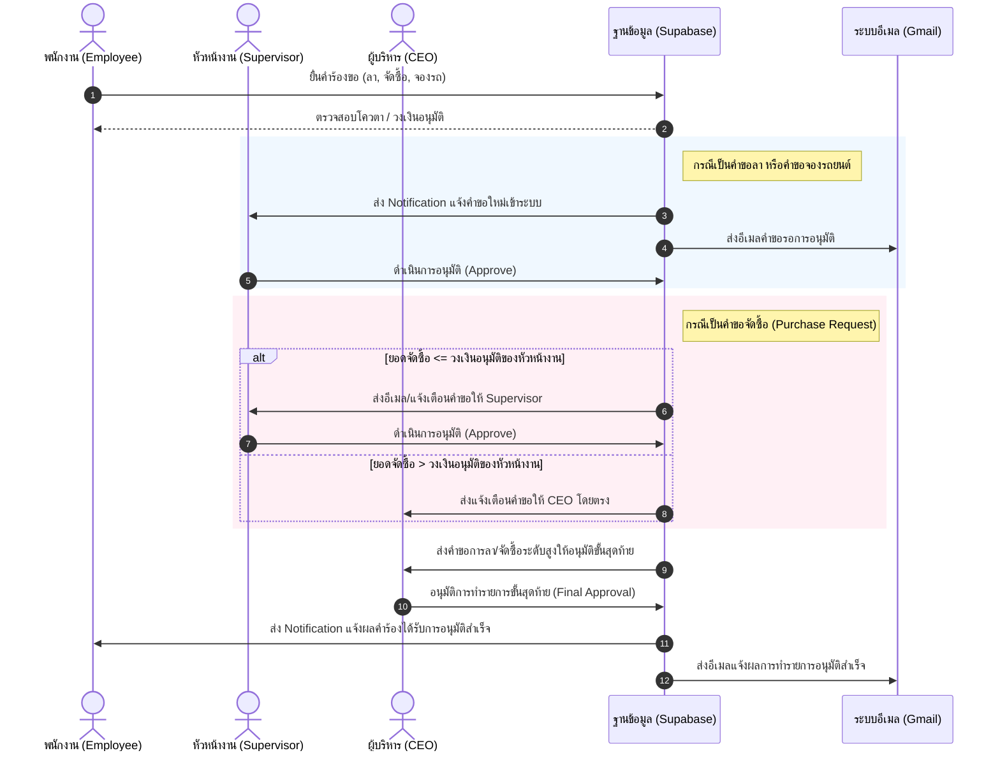
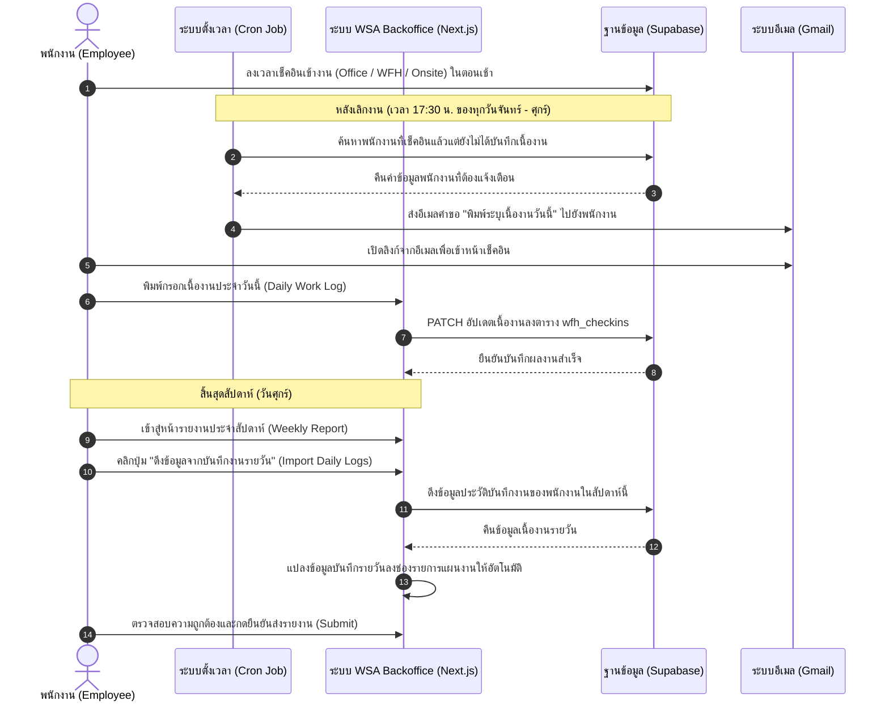
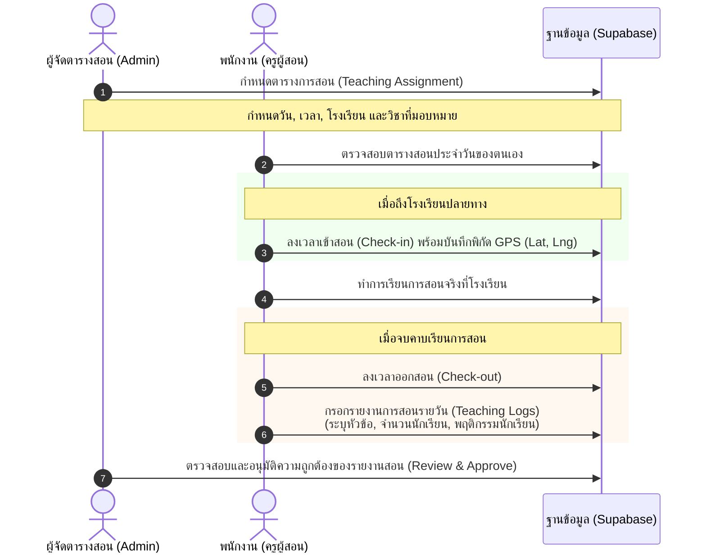

# 📊 แผนภาพลำดับขั้นตอนการทำงาน (Mermaid Sequence Diagrams)

เอกสารรวบรวมแผนภาพลำดับการทำงาน (Sequence Diagrams) ของระบบ **WSA Backoffice** ในรูปแบบ Mermaid เพื่อใช้แสดงเวิร์กโฟลว์การทำงานหลักของระบบ ทั้งในส่วนของการอนุมัติ, การเช็คอินประจำวัน, และการจัดการงานสอน

---

## 1. เวิร์กโฟลว์การอนุมัติเอกสาร (Approval Workflow)
ใช้กับรายการ **การลา (Leave Requests), การจัดซื้อ (Purchase Requests), และการจองรถยนต์บริษัท (Car Bookings)** 

*ไฟล์ดิบ: [approval_workflow.mermaid](file:///c:/Antigravity/WSA_Backoffice/approval_workflow.mermaid)*

---

## 2. เวิร์กโฟลว์บันทึกเนื้องานรายวันและเชื่อมโยงรายงานสัปดาห์ (Daily Work Log Workflow)
ใช้เมื่อพนักงานทำงานครบเวลา และต้องการดึงเนื้องานประจำวันมาเติมลงรายงานสัปดาห์โดยอัตโนมัติ

*ไฟล์ดิบ: [daily_work_log_workflow.mermaid](file:///c:/Antigravity/WSA_Backoffice/daily_work_log_workflow.mermaid)*

---

## 3. เวิร์กโฟลว์ระบบจัดการงานสอน (Teaching Management Workflow)
ใช้กับ **พนักงาน (ครูผู้สอน)** และโรงเรียนเป้าหมายในการลงบันทึกเวลา พิกัด GPS และบันทึกผลการสอนรายวัน

*ไฟล์ดิบ: [teaching_management_workflow.mermaid](file:///c:/Antigravity/WSA_Backoffice/teaching_management_workflow.mermaid)*

