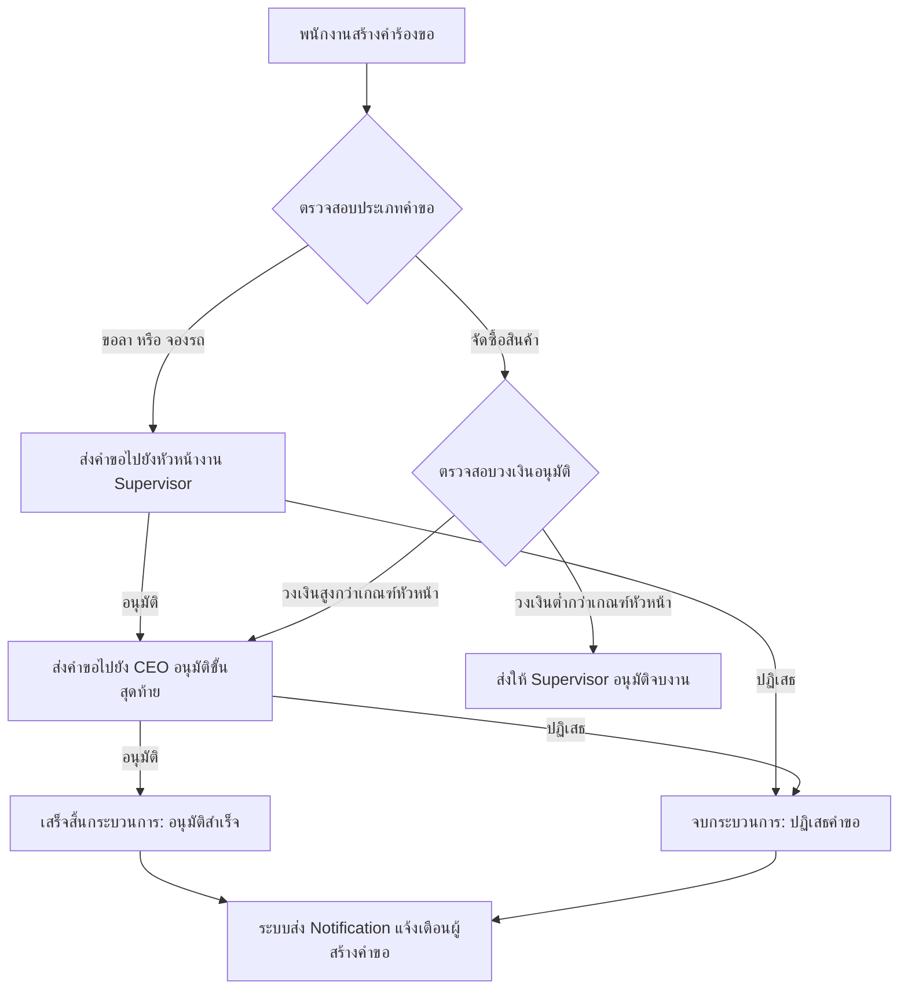
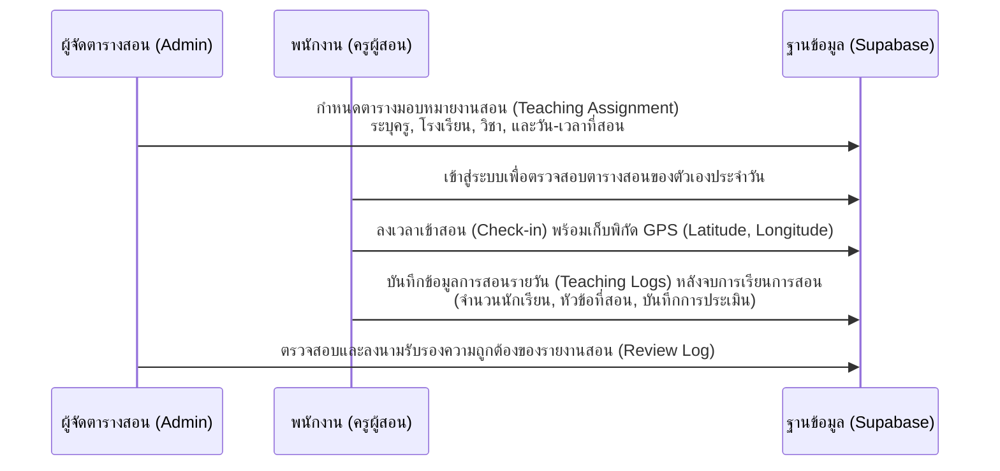
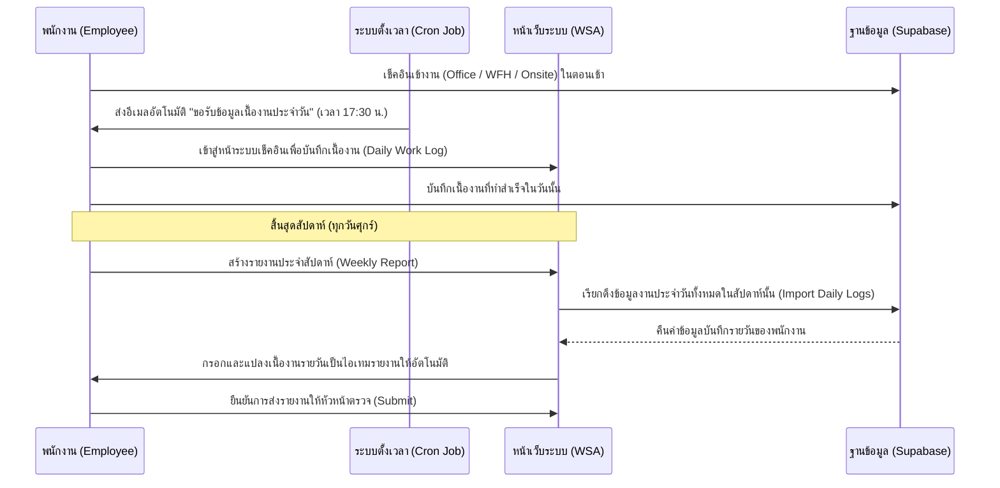

# เอกสารแนะนำฟีเจอร์และลักษณะการทำงานของระบบ (WSA Backoffice / SME Backoffice)

ระบบ **WSA Backoffice (SME Backoffice)** เป็นแพลตฟอร์มการบริหารจัดการภายในองค์กรที่พัฒนาขึ้นด้วยเทคโนโลยีเว็บสมัยใหม่ เพื่อเพิ่มประสิทธิภาพในการทำงานของพนักงาน หัวหน้างาน (Supervisor) ผู้บริหาร (CEO) และผู้ดูแลระบบ (Admin) โดยเชื่อมต่อข้อมูลและจัดทำกระบวนการทำงานให้เป็นดิจิทัลอย่างครบวงจร

---

## 1. คุณลักษณะและฟีเจอร์ของระบบในปัจจุบัน (Current System Features)

ระบบได้รับการออกแบบให้แบ่งตามโมดูลหลัก 12 โมดูล เพื่อรองรับการทำงานในส่วนต่าง ๆ ขององค์กร โดยมีรายละเอียดฟีเจอร์และระดับสิทธิ์การเข้าถึงข้อมูลดังนี้:

### 📑 ตารางสรุปฟีเจอร์และระดับสิทธิ์เข้าใช้งาน
| โมดูลระบบ (Module) | ฟีเจอร์หลัก (Key Features) | บทบาทผู้ใช้งานที่เกี่ยวข้อง (Roles Affected) | ตารางฐานข้อมูลหลัก (Supabase Tables) |
| :--- | :--- | :--- | :--- |
| **1. Authentication & Authorization** | - ลงชื่อเข้าใช้งานด้วย Google OAuth - ระบบตรวจสอบและควบคุมบทบาทพนักงาน (`employee`, `supervisor`, `ceo`, `admin`) | ทุกคนในองค์กร | `users`, `organizations`, `departments`, `positions` |
| **2. Main & CEO Dashboard** | - **Main Dashboard:** หน้าจอพนักงาน สรุปงานส่วนตัว การแจ้งเตือน และสถานะคำขอ - **CEO Dashboard (`/ceo`):** หน้าจอสรุปสำหรับผู้บริหาร ดูภาพรวมค่าใช้จ่าย สถิติการลางาน และรายงานสำคัญ | พนักงานทุกคน / CEO | เชื่อมโยงข้อมูลจากทุกตารางหลัก |
| **3. Admin Management** | - การจัดการบทบาท (Role Management) - การอนุมัติพนักงานใหม่ที่สมัครเข้ามาใช้งานระบบ - การตั้งค่าระบบพื้นฐาน | Admin | `users` |
| **4. Time Attendance & Check-in** | - บันทึกเวลาเข้างานประจำวัน (Office, WFH, On-site) - บันทึกพิกัดภูมิศาสตร์ (GPS Coordinates) - **ระบบบันทึกเนื้องานรายวัน (Daily Work Log):** บันทึกเนื้องานที่สำเร็จหลังเลิกงาน - **ระบบเตือนส่งงานหลังเลิกงาน:** ส่งอีเมลขอรับข้อมูลเนื้องานอัตโนมัติแก่พนักงานที่เช็คอินในวันนั้น | พนักงานทุกคน / HR / Admin | `wfh_checkins` |
| **5. Leave Management** | - ยื่นคำร้องขอลาออนไลน์ (ป่วย, ลากิจ, ลาพักร้อน, อื่นๆ) - ตรวจสอบสิทธิ์และสิทธิ์ลาคงเหลือ (ลากิจ: 3 วัน, ลาพักร้อน: 6 วัน) - ระบบตรวจสอบและป้องกันการขอลาเกินโควตารายปีโดยอัตโนมัติ - อัปโหลดใบรับรองแพทย์ประกอบการลาป่วย | พนักงานทุกคน / Supervisor / CEO | `leave_requests` |
| **6. Purchase Request Management** | - สร้างใบคำร้องขอจัดซื้อสินค้า/บริการพร้อมระบุรายการสินค้าแบบละเอียด (JSONB) - ติดตามสถานะคำสั่งซื้อจากคำร้องจนถึงการจ่ายเงิน (Paid) - การคำนวณภาษีมูลค่าเพิ่ม (VAT), คู่ค้า (Vendor), และลูกค้า (Customer) | พนักงานทุกคน / Supervisor / CEO | `purchase_requests` |
| **7. Car Management & Booking** | - การจองรถยนต์ของบริษัทเพื่อไปปฏิบัติงานภายนอก - ตรวจสอบตารางความพร้อมของรถยนต์ส่วนกลาง - บันทึกเลขไมล์ (Odometer) ตอนเริ่มและสิ้นสุดการใช้งาน | พนักงานทุกคน / Supervisor / Admin | `company_cars`, `car_bookings` |
| **8. Teaching Management (V2)** | - **Teaching Logs:** ครูบันทึกรายงานการสอนรายวัน ระบุหัวข้อที่สอน จำนวนนักเรียน ชั้นเรียน - **Teaching Management:** ผู้จัดตารางสอนมอบหมายงานสอนพนักงาน (ครู) ไปยังโรงเรียนต่าง ๆ ประจำวิชา | ครูผู้สอน / Staff / Admin | `schools`, `subjects`, `teaching_assignments`, `teaching_logs`, `students`, `attendance_records` |
| **9. Reporting System** | - **Weekly Reports:** ส่งรายงานประจำสัปดาห์ **พร้อมปุ่มดึงข้อมูลเนื้องานรายวัน (Import Daily Logs)** อัตโนมัติ - **General Reports:** รายงานสรุปภาพรวมการลา การเข้างาน และการจัดซื้อสำหรับผู้บริหาร | พนักงานทุกคน / Supervisor / CEO | `weekly_reports`, `reports` |
| **10. Approval Center** | - หน้าจอรวมรายการรอดำเนินการ (Pending Requests) สำหรับผู้มีสิทธิ์อนุมัติ (อนุมัติการลา, การจัดซื้อ, การจองรถ) ในจุดเดียว | Supervisor / CEO | `leave_requests`, `purchase_requests`, `car_bookings` |
| **11. Notification System** | - แจ้งเตือนแบบ Real-time เมื่อมีคำขอใหม่ที่ต้องการการอนุมัติ - แจ้งเตือนพนักงานเมื่อคำขอได้รับการอนุมัติ หรือถูกปฏิเสธ | พนักงานทุกคน | `notifications` |
| **12. File Upload Service** | - รองรับการอัปโหลดไฟล์แนบที่เกี่ยวข้อง เช่น เอกสารใบเสนอราคาสำหรับการจัดซื้อ หรือใบรับรองแพทย์ประกอบการลาป่วย | พนักงานทุกคน | Supabase Storage Bucket |

---

## ⚙️ ลักษณะการทำงานของระบบ (System Architecture & Workflows)

### 🖥️ 1. สถาปัตยกรรมทางเทคนิค (Technical Architecture)
ระบบถูกสร้างขึ้นมาในลักษณะ **Modern Serverless Web Application** ประกอบด้วย:
- **Frontend Framework:** Next.js (App Router) พัฒนาด้วย React และ TypeScript ให้การโหลดหน้าเว็บที่รวดเร็วและสนับสนุน SEO
- **Styling:** Tailwind CSS ผนวกกับระบบการออกแบบที่พรีเมียม (Curated Harmonious Color Palettes) และการออกแบบที่ตอบสนองต่อทุกขนาดหน้าจอ (Responsive Web Design)
- **Backend & Database:** **Supabase** ทำหน้าที่เป็น Database (PostgreSQL) และ Authentication Server
- **Security Control:** ระบบใช้นโยบาย **Row Level Security (RLS)** ในระดับฐานข้อมูล เพื่อรับประกันความปลอดภัยของข้อมูล พนักงานแต่ละคนจะสามารถเข้าถึงและแก้ไขข้อมูลเฉพาะส่วนที่ตนเองได้รับอนุญาตตามบทบาท (Role) เท่านั้น

---

### 🔄 2. เวิร์กโฟลว์การทำงานสำคัญในระบบ (Core System Workflows)

#### 🅰️ เวิร์กโฟลว์การอนุมัติเอกสาร (Approval Workflow)
ใช้กับ **การลา (Leave Requests), การจัดซื้อ (Purchase Requests) และการจองรถ (Car Bookings)** โดยมีรูปแบบการทำงานตามลำดับขั้นดังนี้:

1. **การสร้างคำขอ:** พนักงานสร้างเอกสารคำขอผ่านระบบพร้อมแนบไฟล์หรือกรอกรายละเอียด
2. **การตรวจสอบสิทธิ์และสายงานอนุมัติ:** 
   - ระบบจะตรวจหาหัวหน้างาน (`supervisor_id`) ของผู้ยื่นคำร้องโดยอัตโนมัติ
   - ในกรณีของ **การจัดซื้อ (Purchase Request):** จะมีการตรวจสอบ `approval_limit` (วงเงินอนุมัติ) ของตำแหน่งงานผู้มีสิทธิ์อนุมัติ หากยอดจัดซื้อเกินกว่าที่กำหนด ระบบจะผลักภาระการอนุมัติไปยังผู้มีตำแหน่งสูงกว่า หรือ CEO โดยอัตโนมัติ
3. **การแจ้งเตือนและการลงนาม:** หัวหน้างานได้รับแจ้งเตือนและสามารถเข้ามาอนุมัติผ่าน **Approval Center**
4. **เสร็จสิ้นกระบวนการ:** เมื่อได้รับการอนุมัติครบถ้วน ระบบจะปรับปรุงข้อมูลแบบ Real-time และส่งข้อความแจ้งเตือนผลกลับไปยังพนักงานเจ้าของคำขอ

---

#### 🏫 เวิร์กโฟลว์ระบบจัดการงานสอน (Teaching Management Workflow)
ถูกออกแบบมาเป็นพิเศษเพื่อตอบโจทย์องค์กรด้านการจัดหาครูผู้สอนและการจัดการโรงเรียน:

---

#### 📝 เวิร์กโฟลว์บันทึกเนื้องานรายวันและเชื่อมโยงรายงานรายสัปดาห์ (Daily Work Log & Weekly Report Workflow)
ระบบได้รับการออกแบบเพื่อให้ลดภาระของพนักงานในการทำรายงานเมื่อสิ้นสุดสัปดาห์ โดยเปลี่ยนมาเป็นการสะสมข้อมูลวันต่อวัน และดึงข้อมูลไปสร้างรายงานได้แบบคลิกเดียว:

---

## 🛠️ โมดูลและฟีเจอร์ที่อยู่ระหว่างการพัฒนา (Pre-implemented / Under Development Modules)

ระบบ WSA Backoffice ได้รับการจัดเตรียมหน้าจอโครงสร้างและฐานข้อมูลเบื้องต้น (Schema) ไว้เรียบร้อยแล้ว ซึ่งอยู่ระหว่างการเชื่อมโยงระบบสมบูรณ์และเปิดใช้งานจริง ได้แก่:

1. **🪙 ระบบเบิกจ่ายเงินสดย่อย (Reimbursements / Petty Cash):**
   - **ลักษณะการทำงาน:** ให้พนักงานยื่นขอเบิกเงินสดย่อยสำหรับค่าใช้จ่ายฉุกเฉิน เช่น ค่าเดินทาง ค่าจอดรถ ค่าอาหารรับรองลูกค้า โดยระบุจำนวนเงิน วันที่ วันที่จ่าย และอัปโหลดไฟล์ใบเสร็จ (Receipt URL)
   - **ตารางที่รองรับ:** `reimbursements`
2. **💻 ระบบจัดการทรัพย์สินไอทีและสำนักงาน (IT & Office Assets):**
   - **ลักษณะการทำงาน:** ลงทะเบียนรหัสทรัพย์สิน (Asset Tag) ตรวจสอบสถานะการใช้งาน (available, in_use, maintenance, retired) และบันทึกประวัติการส่งมอบทรัพย์สินให้พนักงานแต่ละคนใช้งาน
   - **ตารางที่รองรับ:** `assets`
3. **📢 กระดานประกาศและปฏิทินวันหยุด (Noticeboard & Calendar):**
   - **ลักษณะการทำงาน:** ระบบสื่อสารภายในองค์กรสำหรับ Admin ในการประกาศข่าวสารสำคัญ นโยบายบริษัท และวันหยุดประจำปีให้แสดงผลบนแดชบอร์ดหลักของพนักงานทุกคน
   - **ตารางที่รองรับ:** `announcements`
4. **🎫 ระบบแจ้งซ่อมและรับเรื่องปัญหาไอที (IT Helpdesk Tickets):**
   - **ลักษณะการทำงาน:** พนักงานสามารถส่งคำขอความช่วยเหลือด้านไอทีหรือสิ่งอำนวยความสะดวก พร้อมตั้งค่าระดับความเร่งด่วน (low, medium, high, urgent) เพื่อให้ทีมที่เกี่ยวข้องรับหน้าที่ดำเนินการแก้ไขและอัปเดตสถานะการทำงาน (open, in_progress, resolved, closed)
   - **ตารางที่รองรับ:** `helpdesk_tickets`
5. **📖 คลังความรู้และคู่มือการทำงานส่วนกลาง (Knowledge Base & SOP Center):**
   - **ลักษณะการทำงาน:** แหล่งรวบรวมคู่มือขั้นตอนการทำงาน มาตรฐานการปฏิบัติงาน (SOP) และเอกสารดาวน์โหลดทั่วไป เพื่อส่งเสริมความรู้ภายในองค์กรแบบ Self-service
   - **ตารางที่รองรับ:** `knowledge_base`
6. **🚗 ระบบจองห้องประชุมส่วนกลาง (Meeting Room Booking):**
   - **ลักษณะการทำงาน:** ส่วนต่อขยายของระบบจองสิ่งของส่วนกลาง ช่วยให้พนักงานตรวจสอบความว่างของห้องประชุม ค้นหาสิ่งอำนวยความสะดวกในห้อง และจองห้องประชุมเพื่อหลีกเลี่ยงตารางการใช้งานซ้ำซ้อนกัน

---

## 🚀 ข้อเสนอแนะฟีเจอร์และนวัตกรรมใหม่ในอนาคต (Proposed Future Features)

เพื่อทำให้ระบบ WSA Backoffice กลายเป็นเครื่องมือระดับสูงที่ช่วยขับเคลื่อนองค์กรด้วยข้อมูลและเทคโนโลยีอัจฉริยะ ขอเสนอแนะทิศทางการพัฒนาเพิ่มเติมดังต่อไปนี้:

### 1. 🧠 ระบบตรวจสอบและอนุมัติการจัดซื้ออัจฉริยะด้วย AI (AI-Powered Purchase Audit & OCR)
- **รายละเอียด:** ทำงานร่วมกับ Gemini API หรือเทคโนโลยี OCR เพื่อสแกนใบเสนอราคาหรือใบเสร็จที่พนักงานอัปโหลดเข้ามา จากนั้น AI จะวิเคราะห์เปรียบเทียบราคา ดึงข้อมูลร้านค้าและรายการสินค้ามาป้อนลงในแบบฟอร์มให้อัตโนมัติ พร้อมตรวจจับความผิดปกติ (Anomaly Detection) เพื่อแจ้งเตือนผู้อนุมัติหากพบว่าราคาสูงเกินปกติหรือมีเอกสารซ้ำซ้อน
- **ประโยชน์:** ลดเวลาทำงานและลดข้อผิดพลาดในการกรอกข้อมูลของพนักงาน พร้อมช่วยป้องกันการทุจริตในระบบจัดซื้อ

### 📱 2. ระบบโมบายแอปพลิเคชันพกพาสำหรับครูผู้สอน (WSA Companion Mobile App / PWA)
- **รายละเอียด:** พัฒนาระบบหน้าบ้านให้อยู่ในรูป Progressive Web App (PWA) หรือ Native Mobile App ที่มีฟังก์ชันลงเวลางานและบันทึกตารางสอนแบบออฟไลน์ (Offline-first Mode) ในจุดที่ไม่มีสัญญาณอินเทอร์เน็ต และส่งพิกัด GPS อัตโนมัติเมื่อเดินทางถึงโรงเรียนปลายทางที่ได้รับมอบหมาย
- **ประโยชน์:** เพิ่มความสะดวกสบายในการทำงานให้กับครูผู้สอนที่ต้องปฏิบัติงานนอกสถานที่ตลอดเวลา

### 📊 3. แดชบอร์ดวิเคราะห์ประสิทธิภาพบุคคลและองค์กรขั้นสูง (Advanced CEO & HR Analytics)
- **รายละเอียด:** อัปเกรด CEO Dashboard ให้สามารถวิเคราะห์เชิงทำนาย (Predictive Analytics) เช่น การประเมินความเสี่ยงในการลาออกของพนักงาน (Burnout / Turnover Risk) จากความถี่ในการส่ง Weekly Report และสถิติการลากิจ/ลาป่วย การวิเคราะห์และเปรียบเทียบต้นทุนค่าจัดซื้อของแต่ละฝ่ายแบบไดนามิก และการพยากรณ์อัตราการเข้าสอนของครูในระยะยาว
- **ประโยชน์:** ช่วยให้ผู้บริหารระดับสูงสามารถตัดสินใจเชิงกลยุทธ์ได้อย่างแม่นยำรวดเร็วโดยใช้ข้อมูลจริง (Data-driven Decision)

### 🤖 4. ระบบแจ้งเตือนอัจฉริยะผ่านช่องทางแชต (LINE Notify / Slack / Microsoft Teams Integration)
- **รายละเอียด:** เชื่อมโยงระบบส่งข้อความเข้ากับแพลตฟอร์มแชตที่พนักงานใช้งานเป็นประจำ โดยเมื่อมีเอกสารรอการอนุมัติ หัวหน้างานสามารถรับการแจ้งเตือนบนแชตและกดปุ่ม **"อนุมัติ"** หรือ **"ปฏิเสธ"** ได้ทันทีโดยไม่ต้องเปิดเข้าเว็บระบบ
- **ประโยชน์:** เร่งเวลาการตัดสินใจและการอนุมัติเอกสารภายในองค์กรให้เสร็จสิ้นภายในไม่กี่นาที

### 🗺️ 5. ระบบตรวจสอบพิกัดการลงเวลางานอัจฉริยะ (Geofencing & Smart Check-in)
- **รายละเอียด:** ผูกพิกัดสถานที่ทำงานหลักของพนักงานหรือพิกัดโรงเรียนที่ได้รับมอบหมายเข้ากับระบบลงเวลาทำงาน (Check-in) โดยระบบจะอนุญาตให้พนักงานลงเวลาเข้างานได้ก็ต่อเมื่ออยู่ในรัศมี (เช่น 100 เมตร) ของพื้นที่ปฏิบัติงานจริงเท่านั้น
- **ประโยชน์:** ป้องกันข้อผิดพลาดในการลงเวลาการทำงาน และรับประกันความน่าเชื่อถือของรายงานส่งมอบงานภายนอกสถานที่
