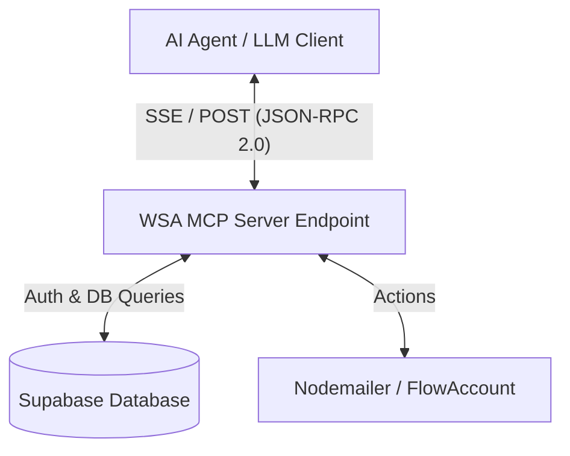

# Proposal: MCP Server Integration for AI Agents

This proposal outlines the architectural design and implementation plan for adding a **Model Context Protocol (MCP)** server to the **WSA Backoffice** system. This will enable external AI Agents (such as Cursor, Windsurf, Claude Desktop, or custom LLM clients) to securely connect to the WSA Backoffice, inspect data, and execute operations.

---

## 1. Architectural Overview

The Model Context Protocol (MCP) standardizes how AI models interact with databases, tools, and APIs. We will expose the WSA Backoffice as an **MCP Server** using **Server-Sent Events (SSE)** transport, allowing it to run within the existing Next.js web application.



### Key Components:
1. **Transport Layer**: `Server-Sent Events (SSE)` for bidirectional communication over HTTP (ideal for Next.js hosting).
2. **Protocol Standard**: `JSON-RPC 2.0` (handled by the official `@modelcontextprotocol/sdk`).
3. **Authentication Layer**: Bearer API Key validation (`X-MCP-API-Key`) to prevent unauthorized access.

---

## 2. Exposing Capabilities (Resources & Tools)

We will configure the MCP Server to expose the following capabilities to the AI Agent:

### A. Tools (Executable Functions)
Tools allow the AI Agent to perform actions or fetch filtered database values.

#### 1) Teaching & School Logs
| Tool Name | Parameters | Description |
| :--- | :--- | :--- |
| `list_schools` | None | Lists all client schools. |
| `get_assignments` | `teacher_id?` (string) | Lists active teaching assignments and schedule dates. |
| `get_overdue_reports` | None | Queries classes taught in the past 5+ days that lack submitted reports. |
| `submit_teaching_report` | `assignment_id` (string), `date` (string), `topics_covered` (string), `homework_assigned` (string), `student_behavior` (string), `attendance` (array) | Submits a new teaching log and checks in students. |
| `review_teaching_report` | `log_id` (string), `action` (`approve` or `reject`), `feedback?` (string) | Approves the report or sends it back to the teacher with feedback. |

#### 2) Attendance & Check-in System
| Tool Name | Parameters | Description |
| :--- | :--- | :--- |
| `check_in` | `type` (`teaching` \| `office`), `location?` (string), `notes?` (string) | Performs daily attendance check-in. |
| `check_out` | `log_id` (string), `notes?` (string) | Performs daily attendance check-out. |

#### 3) Leave Request System (Leave Requests)
| Tool Name | Parameters | Description |
| :--- | :--- | :--- |
| `submit_leave_request` | `leave_type` (`sick` \| `personal` \| `vacation`), `start_date` (string), `end_date` (string), `reason` (string) | Submits a leave request for approval. |
| `get_pending_leaves` | None | Lists pending leave requests for supervisors. |
| `approve_leave` | `request_id` (string), `action` (`approve` \| `reject`), `note?` (string) | Approves or rejects a leave request. |

#### 4) Disbursement & Cash Requests (Purchases / Reimbursements)
| Tool Name | Parameters | Description |
| :--- | :--- | :--- |
| `submit_purchase_request` | `title` (string), `category` (string), `payment_method` (string), `purpose` (string), `total_amount` (number), `items` (array) | Submits a new cash/reimbursement request. |
| `get_pending_purchases` | None | Lists pending cash requests awaiting approval. |
| `approve_purchase` | `purchase_id` (string), `action` (`approve` \| `reject`), `note?` (string) | Approves or rejects a purchase/cash request. |

#### 5) Car Booking System (Car Bookings)
| Tool Name | Parameters | Description |
| :--- | :--- | :--- |
| `list_cars` | None | Lists all company vehicles and availability. |
| `book_car` | `car_id` (string), `destination` (string), `purpose` (string), `start_time` (string), `end_time` (string) | Books a vehicle for business travel. |
| `approve_car_booking` | `booking_id` (string), `action` (`approve` \| `reject`), `note?` (string) | Approves or rejects a vehicle booking request. |

---

### B. Resources (Static Data Feeds)
Resources allow the AI Agent to read state/reports as text markdown or JSON.

| URI Scheme | Description |
| :--- | :--- |
| `wsa://reports/school/{school_id}?month={yyyy-mm}` | Fetch the monthly school report summary. |
| `wsa://teachers/performance` | Fetch teacher submission rates and punctuality metrics. |
| `wsa://cash-flows/monthly?month={yyyy-mm}` | Fetch monthly disbursement statistics. |
| `wsa://car-bookings/schedule?date={yyyy-mm-dd}` | Fetch the booking schedule for all vehicles on a specific date. |

---

## 3. Reference Implementation (Next.js Endpoint)

We can build this directly inside Next.js using `@modelcontextprotocol/sdk`. Below is the expanded API route structure:

### Endpoint: `app/api/mcp/route.ts`

```typescript
import { NextRequest } from "next/server"
import { McpServer } from "@modelcontextprotocol/sdk/server/mcp.js"
import { SSEServerTransport } from "@modelcontextprotocol/sdk/server/sse.js"
import { createSupabaseServerClient } from "@/lib/supabase"
import { z } from "zod"

// 1. Initialize MCP Server
const server = new McpServer({
  name: "WSA Backoffice MCP Server",
  version: "1.0.0"
})

// 2. Define list_schools Tool
server.tool(
  "list_schools",
  "Retrieve list of client schools in the database",
  {},
  async () => {
    const supabase = createSupabaseServerClient()
    const { data: schools, error } = await supabase.from("schools").select("id, name")
    if (error) return { content: [{ type: "text", text: `Error: ${error.message}` }] }
    return { content: [{ type: "text", text: JSON.stringify(schools, null, 2) }] }
  }
)

// 3. Define submit_leave_request Tool
server.tool(
  "submit_leave_request",
  "Submit a leave request (sick, personal, vacation)",
  {
    leaveType: z.enum(["sick", "personal", "vacation"]),
    startDate: z.string().regex(/^\d{4}-\d{2}-\d{2}$/, "YYYY-MM-DD format"),
    endDate: z.string().regex(/^\d{4}-\d{2}-\d{2}$/, "YYYY-MM-DD format"),
    reason: z.string()
  },
  async ({ leaveType, startDate, endDate, reason }) => {
    const supabase = createSupabaseServerClient()
    const { data, error } = await supabase
      .from("leave_requests")
      .insert({
        leave_type: leaveType,
        start_date: startDate,
        end_date: endDate,
        reason: reason,
        status: "pending"
      })
      .select()
      .single()

    if (error) return { content: [{ type: "text", text: `Failed: ${error.message}` }] }
    return { content: [{ type: "text", text: `Success! Leave Request ID: ${data.id}` }] }
  }
)

// 4. Define approve_purchase Tool (Disbursements)
server.tool(
  "approve_purchase",
  "Approve or reject a cash reimbursement request",
  {
    purchaseId: z.string(),
    action: z.enum(["approve", "reject"]),
    note: z.string().optional()
  },
  async ({ purchaseId, action, note }) => {
    const supabase = createSupabaseServerClient()
    const status = action === "approve" ? "approved" : "rejected"
    const { data, error } = await supabase
      .from("purchase_requests")
      .update({
        status: status,
        approver_note: note || null,
        approved_at: new Date().toISOString()
      })
      .eq("id", purchaseId)
      .select()
      .single()

    if (error) return { content: [{ type: "text", text: `Failed: ${error.message}` }] }
    return { content: [{ type: "text", text: `Success! Purchase request status updated to: ${data.status}` }] }
  }
)

// 5. Define book_car Tool (Car Bookings)
server.tool(
  "book_car",
  "Book a company vehicle for business travel",
  {
    carId: z.string(),
    destination: z.string(),
    purpose: z.string(),
    startTime: z.string(), // ISO string
    endTime: z.string() // ISO string
  },
  async ({ carId, destination, purpose, startTime, endTime }) => {
    const supabase = createSupabaseServerClient()
    const { data, error } = await supabase
      .from("car_bookings")
      .insert({
        car_id: carId,
        destination: destination,
        purpose: purpose,
        start_time: startTime,
        end_time: endTime,
        status: "pending"
      })
      .select()
      .single()

    if (error) return { content: [{ type: "text", text: `Failed: ${error.message}` }] }
    return { content: [{ type: "text", text: `Success! Vehicle Booking ID: ${data.id}` }] }
  }
)

// 6. SSE Connections Handler
let transport: SSEServerTransport | null = null

export async function GET(req: NextRequest) {
  // Security Check
  const apiKey = req.nextUrl.searchParams.get("apiKey")
  if (apiKey !== process.env.MCP_API_KEY) {
    return new Response("Unauthorized", { status: 401 })
  }

  // Create SSE Transport stream
  const responseHeaders = new Headers({
    "Content-Type": "text/event-stream",
    "Cache-Control": "no-cache",
    "Connection": "keep-alive"
  })

  transport = new SSEServerTransport("/api/mcp/message", responseHeaders)
  await server.connect(transport)

  return transport.response
}

export async function POST(req: NextRequest) {
  if (!transport) return new Response("No active connection", { status: 400 })
  const message = await req.json()
  await transport.handleMessage(message)
  return new Response("OK")
}
```

---

## 4. How to Connect an AI Agent (Client Setup)

Once deployed, you can connect any MCP-capable client (like Claude Desktop) by adding the server to its settings file:

```json
{
  "mcpServers": {
    "wsa-backoffice": {
      "command": "node",
      "args": ["path-to-standalone-mcp-script.js"],
      "env": {
        "SUPABASE_URL": "https://...",
        "SUPABASE_SERVICE_ROLE_KEY": "..."
      }
    }
  }
}
```

Alternatively, if using the SSE web endpoint, the client can use an **SSE Client Wrapper** pointing to `https://hrm.wirelesssolution.asia/api/mcp?apiKey=YOUR_SECRET_KEY`.

---

## 5. Security & Isolation Considerations
> [!WARNING]
> **Data Security**: Exposing writing capabilities (like deleting assignments or modifying grades) to AI Agents must be strictly audited.
> **Key Management**: The `MCP_API_KEY` should be a strong, randomly generated string stored securely in `.env.local` and not shared in public git commits.
